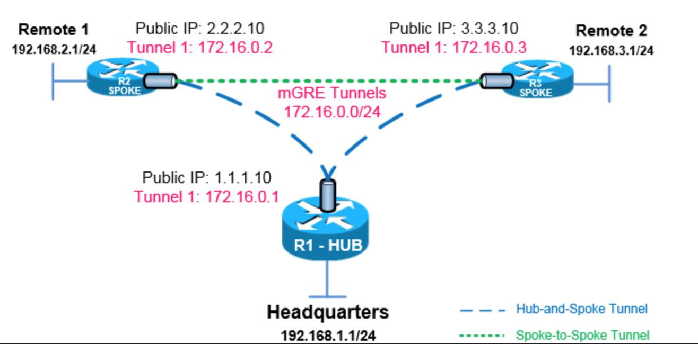

# DMVPN with iBGP

Dynamic Multipoint VPN (DMVPN) is increasing the demands of enterprise companies to be able to connect branch offices with head offices and between each other while keeping costs low, minimising configuration complexity and increasing flexibility. With DMVPN, one central router, usually placed at the head office, undertakes the role of the Hub while all other branch routers are Spokes that connect to the Hub router so the branch offices can access the company’s resources. This script easily deployment DMVPN with iBGP.

